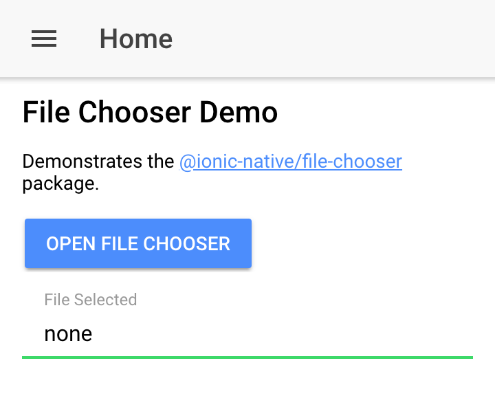

# Ionic File Chooser Demo

Demonstrates the <a target="_blank" href="https://ionicframework.com/docs/native/file-chooser/">@ionic-native/file-chooser</a> package.

Displays the URI of a chosen file after selecting it with the chooser dialog.

**Only works when building for and running on Android.**

## Build & Run

Build and run as usual.

```sh
npm install

ionic cordova platform add android

ionic cordova build android

cordova run android
```

## Screenshot


